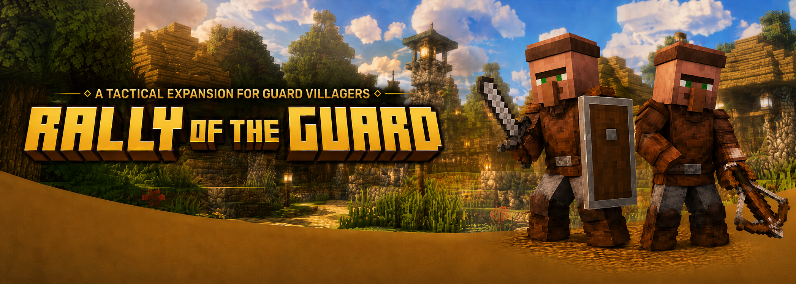
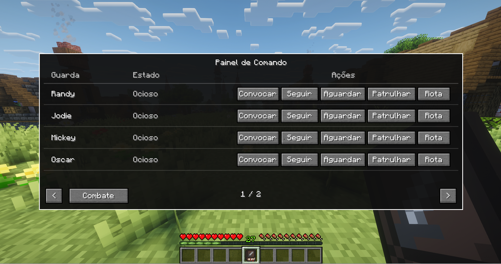
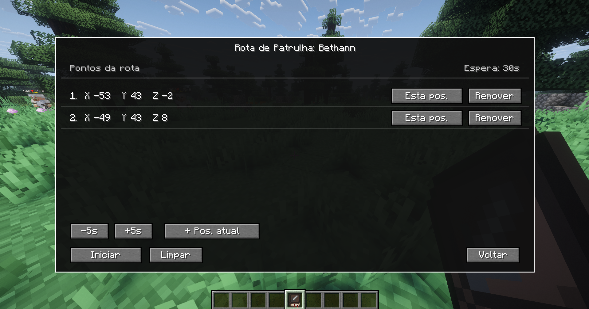
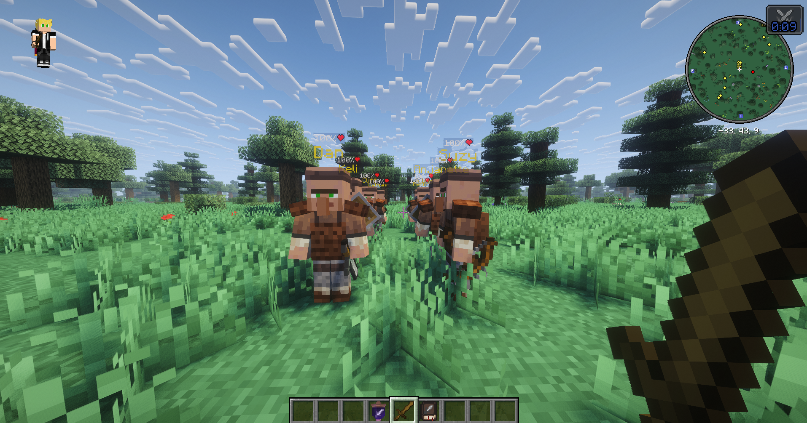
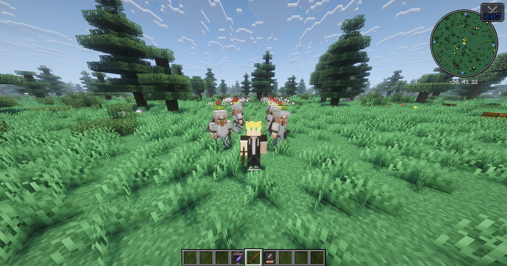
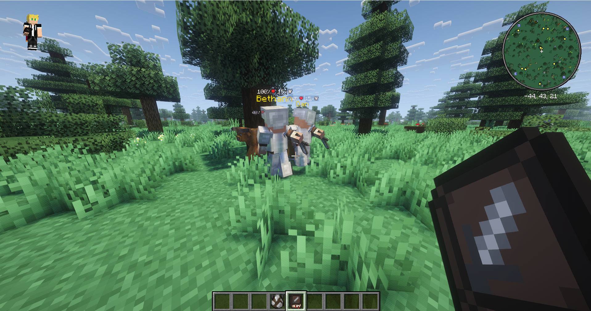

# Rally of the Guard

**Your village guards are no longer decorations. They are your squad.**

Rally of the Guard is a lightweight tactical expansion for
[Guard Villagers (Fabric/Quilt)](https://www.curseforge.com/minecraft/mc-mods/guard-villagers-fabric).
Hire guards, command them from anywhere, rally them before a fight, and build patrol routes around your village,
base, fortress, or modpack settlement.

---

[CurseForge](https://www.curseforge.com/members/thecyber27/projects) |
[GitHub](https://github.com/HyanFerreira) |
[Issues](ISSUES_LINK_HERE)

---

## About

Rally of the Guard gives your hired guards actual purpose.

Instead of standing around as village decoration, guards can be organized into a tactical force. Use the Commander's
Ledger to control individual guards, send them to patrol posts, make them wait, call them back to you, or assign a
looping patrol route that keeps your base feeling alive.

The mod is designed to work with the existing Guard Villagers AI instead of replacing it. Guards still move, fight,
react, and defend using their native behavior. Rally of the Guard simply gives players better tools to command them.

---

## Features

### Commander's Ledger

The Commander's Ledger is your portable command panel.

- View your hired guards in one place.
- See each guard's current order state.
- Summon a selected guard to your position.
- Order guards to follow, wait, patrol, or run a route.
- Manage your squad without needing a keybind.

Current guard states include:

- **Idle**
- **Following**
- **Waiting**
- **On patrol**
- **On route**

---

### Patrol Routes

Build real patrol routes for your guards.

- Create routes with up to **5 points**.
- Add points using your current position.
- Choose how long guards wait at each point.
- Start, pause, clear, and edit routes from the route screen.
- Routes loop until paused or cleared.

Once a route is active, the guard walks to the current point, waits, then receives the next point as its patrol
position. If hostile mobs appear along the way, the guard's normal combat AI can still take over.

---

### Scroll of Rallying

When danger arrives, rally your squad.

- Shift + right-click to toggle the rally.
- Nearby hired guards are pulled into formation around you.
- Rallied guards follow you without requiring Hero of the Village.
- Patrolling and waiting guards keep their current orders.
- Friendly fire protection helps prevent accidental hits during the rally.

---

### Patrol Posts

Need a guard at the gate? At the farm? Near the storage room?

Use the Commander's Ledger to assign a fixed patrol position. The guard will move to that location and hold the post
using Guard Villagers' native patrol behavior.

---

## Why Use This Mod?

Minecraft villages feel better when their guards act like an organized force.

Rally of the Guard keeps the spirit of Guard Villagers, but adds the missing tactical layer:

- villages feel more defended;
- bases feel more alive;
- guards become useful companions instead of passive background mobs;
- patrol routes make settlements feel active even when you are not micromanaging them.

It is especially useful for survival worlds, RPG packs, village-focused packs, medieval packs, and personal modpacks
where guards should feel like part of the player's story.

---

## Media

---

## Installation

- Install on both **client and server**.
- Requires **Fabric**.
- Requires **Fabric API**.
- Requires **Guard Villagers (Fabric/Quilt)**.
- Requires **Java 21+**.

---

## Notes

- Guard commands work only while the guard is loaded in the current world.
- Patrol routes pause naturally if the guard's chunk is unloaded.
- Routes are stored on the guard and survive world reloads.
- This mod does not replace Guard Villagers combat AI; it builds command tools around it.

---

## Credits

Created by **Hyan Ferreira**.

Built as a tactical expansion for **Guard Villagers (Fabric/Quilt)**.
